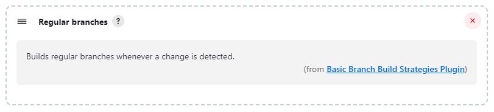
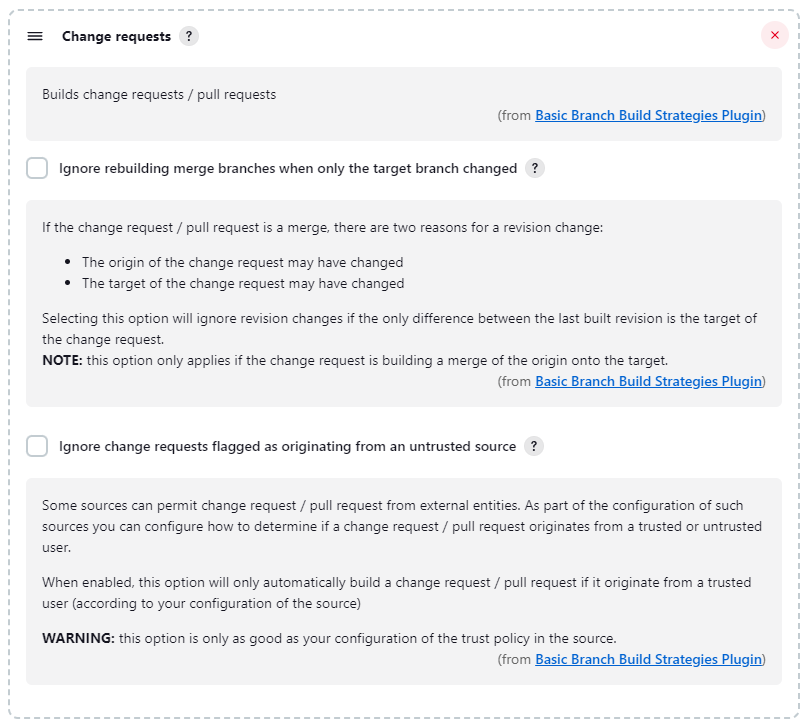
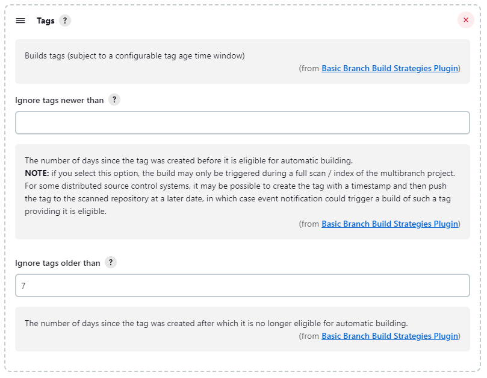

== User guide

This document provides the user guide to the functionality provided by the Basic Branch Build Strategies plugin.

=== Background

The http://wiki.jenkins.io/display/JENKINS/Branch+API+Plugin[Branch API] plugin provides an extension point that allows control over whether to build a branch (or branch like things such as change requests and tags) whenever it is discovered initially or a change from the previous revision has been detected.
By design, the plugin does not provide any concrete implementations of this extension point, leaving the actual implementation to extension plugins.
In the absence of any configured `BranchBuildStrategy` the default for the http://wiki.jenkins.io/display/JENKINS/Branch+API+Plugin[Branch API] plugin is to build everything except tags.

This plugin is an extension plugin for http://wiki.jenkins.io/display/JENKINS/Branch+API+Plugin[Branch API] that provides some basic `BranchBuildStrategy` implementations.

=== Strategies

NOTE: As soon as you add any strategy to your Multibranch project or Organization folder, you disable the defaults of "build everything except tags".

==== Regular branches

This strategy will build "regular" branches (also known as streams in some source control systems).
In otherwords, if it is not a change request and if it is not a tag, then it should be built on initial discovery and every time a revision change is detected.

==== Change requests

This strategy will build change requests (also known as pull requests in some source control systems).

There is one configuration option available:

Ignore rebuilding merge branches when only the target branch changed::
If the change request / pull request is a merge, there are two reasons for a revision change:
+
====
. The origin of the change request may have changed
. The target of the change request may have changed
====
+
Selecting this option will ignore revision changes if the only difference between the last built revision is the target of the change request.
+
NOTE: this option only applies if the change request is building a merge of the origin onto the target.

==== Tags

This strategy will build tags (also known as snapshots in some source control systems).

There are two configuration option available:

Ignore tags newer than::
The number of days since the tag was created before it is eligible for automatic building.
+
NOTE: if you select this option, the build may only be triggered during a full scan / index of the multibranch project.
For some distributed source control systems, it may be possible to create the tag with a timestamp and then push the tag to the scanned repository at a later date, in which case event notification could trigger a build of such a tag providing it is eligible.

Ignore tags older than::
The number of days since the tag was created after which it is no longer eligible for automatic building.
